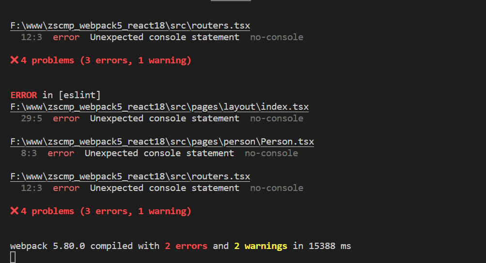

# 配置代码检测 Eslint

## 为什么要使用 Eslint
- 保证所有人统一的代码开发规范
- ESLint 是在 ECMAScript/JavaScript 代码中识别和报告模式匹配的工具，它的目标是保证代码的一致性和避免错误。
- 有些lint规则可以避免bug的产生，在提高代码可读性的前提下，减少问题数量，将问题更多的暴露在开发阶段。

## 安装依赖
```
npm install eslint eslint-webpack-plugin -D
```

## 创建配置文件
在项目的根路径下添加 ESLint 的配置文件：`.eslintrc.js`

```js
module.exports = {
  root: true,
  env: {
    node: true,
    browser: true
  },
  extends: ['eslint:recommended'],
  parserOptions: {
    ecmaVersion: 6,
    sourceType: "module"
  },
  rules: {
    'no-var': 'error',
    'no-console': 'error'
  }
}
```
配置项参数：
- root - 限定配置文件的使用范围
- parser - 指定eslint的解析器
- parserOptions - 设置解析器选项
- extends - 指定eslint规范
- plugins - 引用第三方的插件
- env - 指定代码运行的宿主环境
- rules - 启用额外的规则或覆盖默认的规则
- globals - 声明在代码中的自定义全局变量

## 修改 webpack 配置
修改 config/webpack.common.js

```js
...
const ESLintWebpackPlugin = require('eslint-webpack-plugin')

module.exports = {
  ...
  plugins: [
    new ESLintWebpackPlugin({
      extensions:['js','jsx','ts','tsx']
    })
  ],
  ...
}
```
更多配置项请参考 [EslintWebpackPlugin](https://webpack.docschina.org/plugins/eslint-webpack-plugin/)

## 启动项目查看效果
```
npm run start
```



这时候控制台抛出了所有不符合代码规范的提示啦

## 实时检测代码规范

在 vscode 安装 ESLint 插件，就可以在编写代码的同时就可以实时检测代码的规范了。


## git 提交校验

修改 `package.json`

```json{5}
...
"lint-staged": {
  "src/**/*.{ts,tsx,js,jsx}": [
    "prettier --write",
    "eslint --ext .js,.jsx,.ts,.tsx"
  ]
}
...
```

