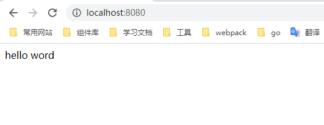

# 从零开始搭建

## 1.创建项目文件夹

创建项目文件夹 `zscmp_webpack5_react18`

## 2.创建 package.json

在项目文件夹下运行 `npm init` ，一路回车键创建 package.json 文件

## 3.安装常用包

```cmd
npm install react@18 react-dom@18
npm install -D @types/react@18 @types/react-dom@18
npm install -D webpack@5 webpack-cli@5 webpack-dev-server@4 webpack-merge@5 html-webpack-plugin@5
npm install -D babel-loader@9 @babel/core@7
npm install -D css-loader@6 less-loader@11 less@4 style-loader@3
npm install -D cross-env@7

npm install babel-polyfill@6
npm install -D postcss-loader@7 autoprefixer@10
npm install -D prettier@2
npm install -D @types/node@18 webpack-bundle-analyzer@4 @babel/preset-react@7
```

## 4.配置 Webpack

在项目根目录下创建 `config` 文件夹，并在 `config` 文件夹内创建下面四个文件

##### `utils.js`

```js
const isDev = process.env.NODE_ENV === 'development'
const isProd = process.env.NODE_ENV === 'production'

const getStyleLoaders = (preProcessor) => {
  return ['style-loader', 'css-loader', preProcessor].filter(Boolean)
}

module.exports = {
  getStyleLoaders,
  isProd,
  isDev,
}
```

##### `webpack.common.js`

```js
const path = require('path')
const { getStyleLoaders } = require('./utils.js')
const HtmlWebpackPlugin = require('html-webpack-plugin')

module.exports = {
  entry: [path.resolve(__dirname, '../src/main.js')],
  output: {
    filename: 'js/[name].js',
    clean: true,
  },
  resolve: {
    extensions: ['.jsx', '.js'],
  },
  module: {
    rules: [
      {
        test: /\.css$/,
        use: getStyleLoaders(),
      },
      {
        test: /\.less$/,
        use: getStyleLoaders('less-loader'),
      },
      {
        test: /.(js|jsx)$/,
        use: {
          loader: 'babel-loader',
          options: {
            presets: ['@babel/preset-react'],
          },
        },
      },
    ],
  },
  plugins: [
    new HtmlWebpackPlugin({
      filename: 'index.html',
      template: path.resolve(__dirname, '../public/index.html'),
    }),
  ],
}
```

##### `webpack.dev.js`

```js
const { merge } = require('webpack-merge')
const common = require('./webpack.common.js')
const webpack = require('webpack')

const config = merge(common, {
  mode: 'development',
  devtool: 'inline-source-map',
  devServer: {
    hot: true,
    open: true,
    historyApiFallback: true, // 解决路由 404
  },
  plugins: [new webpack.HotModuleReplacementPlugin()],
})

module.exports = config
```

##### `webpack.prod.js`

```js
const { merge } = require('webpack-merge')
const path = require('path')
const common = require('./webpack.common.js')

const config = merge(common, {
  output: {
    filename: 'js/[name].[contenthash:10].js',
    path: path.resolve(__dirname, '../dist'),
  },
  mode: 'production',
  devtool: 'source-map',
  plugins: [].filter(Boolean),
})

module.exports = config
```

## 5.修改 package.json

修改 _scripts_ 和 增加 _browserslist_

```json
"scripts": {
    "start": "cross-env NODE_ENV=development webpack server --progress --config config/webpack.dev.js",
    "build": "cross-env NODE_ENV=production webpack --config config/webpack.prod.js",
  },
  "browserslist": [
    "> 1%",
    "last 2 versions",
    "ie >= 8"
  ],
```

## 6.配置其它基本文件

依次在项目根目录下创建下面这些文件

##### `.gitignore`

```
.DS_Store
node_modules/
/dist/
npm-debug.log*
yarn-debug.log*
yarn-error.log*
# Editor directories and files
.idea
.vscode
*.suo
*.ntvs*
*.njsproj
*.sln
```

##### `README.md`

````markdown
安装项目依赖

```bash
npm install
```

启动项目

```bash
npm run start
```

打包构建项目

```bash
npm run build
```

分析打包后文件大小

```bash
npm run build:analyz
```
````

## 7.创建项目首页模板文件

在项目根目录下创建 `public` 文件夹，并在 `public` 文件夹下创建项目首页模板文件 `index.html`

##### `index.html`

```html
<!DOCTYPE html>
<html lang="en">
  <head>
    <meta charset="UTF-8" />
    <meta
      name="viewport"
      content="width=device-width, user-scalable=no, initial-scale=1.0, maximum-scale=1.0, minimum-scale=1.0"
    />
    <meta http-equiv="X-UA-Compatible" content="ie=edge" />
    <meta name="description" content="webpack5+react18+ts从零开始搭建项目" />
    <meta name="Keywords" content="webpack5,react18,从零开始搭建" />
    <title>webpack5-react18</title>
  </head>
  <body>
    <div id="app"></div>
  </body>
</html>
```

## 8.创建项目入口文件

在项目根目录下创建项目主目录 `src` 目录，并在 `src` 目录下创建入口文件 `main.js` 和 `App.jsx`

##### `main.js`

```js
import React from 'react'
import { createRoot } from 'react-dom/client'
import App from './App'

createRoot(document.getElementById('app')).render(<App />)
```

##### `App.jsx`

```js
import React from 'react'

const App = () => {
  return <h1>webpack react ts</h1>
}

export default App
```

## 9.启动项目

在项目根目录下运行 `npm run start` ，效果如下：



