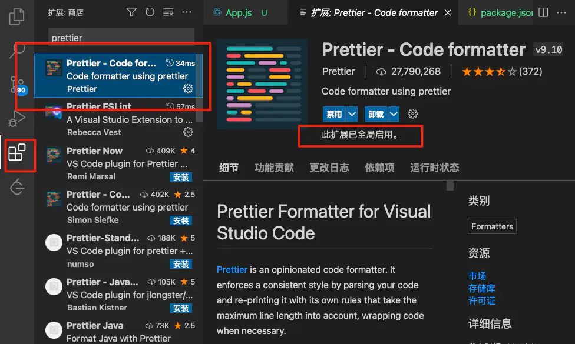

# 自动格式化代码 Prettier

## 方式一
在 Vscode 编辑器每次保存代码时自动格式化代码

#### 1.安装 Vscode 插件 Prettier，并启用插件



#### 2.在 Vscode 配置文件开启保存代码自动格式化配置

```
"editor.formatOnSave": true, // 保存代码时自动格式化代码
"editor.defaultFormatter": "esbenp.prettier-vscode", //配置html css js的默认格式化程序
```


#### 3.在项目根目录下创建 `.prettierrc.js` 和 `.prettierignore` 两个文件

`.prettierrc.js` 配置格式化规则

```js
module.exports = {
  printWidth: 100,
  tabWidth: 2,
  useTabs: false,
  semi: false, // 是否在句尾打印分号
  singleQuote: true, //  是否使用单引号
  quoteProps: "as-needed", // 仅在需要时在对象属性周围添加引号
  jsxSingleQuote: false, //  jsx是否使用单引号
  trailingComma: "none", // 没有尾随逗号
  bracketSpacing: true, // 对象 {} 是否留空格 例如： true { foo: bar }  false {foo: bar}
  jsxBracketSameLine: false, // 将多行 JSX 元素的 /> 单独放一行
  bracketSameLine: false, // 将多行 HTML, JSX, Vue, Angular 元素的 /> 单独放一行
  arrowParens: "always", // 在箭头函数参数周围包含括号
  proseWrap: "preserve",
  htmlWhitespaceSensitivity: "css",
  vueIndentScriptAndStyle: false,
  endOfLine: "lf",
};
```

`.prettierignore` 忽略你不希望格式化的文件

```
.DS_Store
node_modules
coverage
.vscode
.husky
.git
```

## 方式二
每次提交代码时自动对提交的文件进行代码格式化

#### 1.安装 npm 包
- prettier: 功能依赖包
- husky: 提供 gitHook 相关功能 
- lint-staged: 让命令只对发生更改的文件生效

```cmd
npm install -D prettier
npx mrm@2 lint-staged
```
上面两个命令的执行顺序不能颠倒

`npx mrm@2 lint-staged` 命令将安装husky和lint-stage，然后将配置添加到 `package.json` 中。它将自动格式化预提交钩子中支持的文件。

#### 2.修改 `package.json` 文件

```js{3-5}
...
"lint-staged": {
  "src/**/*.{ts,tsx,js,jsx}": [
    "prettier --write"
  ]
}
...
```