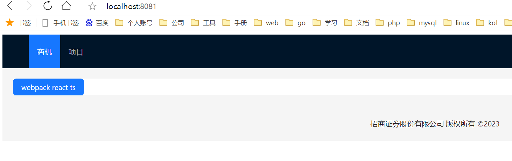

# 配置路由 react-router-dom

## 1.安装 `react-router-dom` 包

```
npm install react-router-dom@6
```

## 2.创建路由文件 `src/router.js`

```tsx
import React from 'react'
import { useRoutes } from 'react-router-dom'
import LayoutPage from './pages/layout'
import Home from './pages/home'
import Project from './pages/project'

const Routers = () => {
  return useRoutes([
    {
      path: '/',
      element: <LayoutPage />,
      children: [
        {
          index: true,
          element: <Home />,
        },
        {
          path: 'home',
          element: <Home />,
        },
        {
          path: 'project',
          element: <Project />,
        },
      ],
    },
    {
      path: '*',
      element: <Page404 />,
    },
  ])
}

export default Routers
```

## 3.修改 `src/App.tsx` 文件内容

```tsx{2-11}
import React from 'react'
import { BrowserRouter as Router } from 'react-router-dom'
import Routers from './routers'

const App = () => {
  return (
    <Router>
      <Routers />
    </Router>
  )
}

export default App
```

## 4.创建路由配置的文件

##### 4.1 创建 `src/layout/index.tsx` 文件

```tsx
import React, { useEffect } from 'react'
import { Layout, Menu, theme } from 'antd'
import { Outlet, useNavigate, useLocation } from 'react-router-dom'

const { Header, Content, Footer } = Layout

const navs = [
  {
    key: '/',
    label: '商机',
    title: '商机',
  },
  {
    key: '/project',
    label: '项目',
    title: '项目',
  },
]

const LayoutPage: React.FC = () => {
  const navigate = useNavigate()
  const location = useLocation()
  const {
    token: { colorBgContainer },
  } = theme.useToken()

  useEffect(() => {
    console.log(location)
  }, [])

  return (
    <Layout className="layout">
      <Header>
        <div className="logo" />
        <Menu
          theme="dark"
          mode="horizontal"
          defaultSelectedKeys={[location.pathname || '/']}
          items={navs}
          onClick={(e) => {
            navigate(e.key)
          }}
        />
      </Header>
      <Content style={{ padding: '20px' }}>
        <div className="site-layout-content" style={{ background: colorBgContainer }}>
          <Outlet />
        </div>
      </Content>
      <Footer style={{ textAlign: 'center' }}>招商证券股份有限公司 版权所有 ©2023</Footer>
    </Layout>
  )
}

export default LayoutPage
```

##### 4.2 创建 `src/home/index.tsx` 文件

```tsx
import React from 'react'
import { Button } from 'antd'

const Home: React.FC = () => {
  return <Button type="primary">webpack react ts</Button>
}

export default Home
```

##### 4.3 创建 `src/project/index.tsx` 文件

```tsx
import React from 'react'

const Project: React.FC = () => {
  return <>project</>
}

export default Project
```

##### 4.4 显示效果

点击商机和项目可以显示不同的页面


