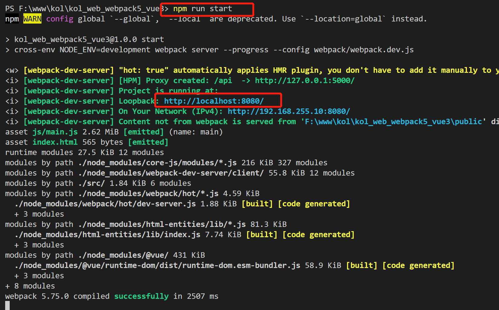
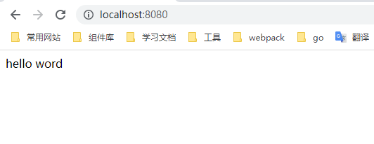

# 从零开始搭建

## 创建项目文件夹

创建项目文件夹 `kol_webpack5_vue3`

## 创建 package.json

在项目文件夹下运行 `npm init` ，一路回车键创建 package.json 文件

## 安装常用包

```cmd
npm install vue@3 vue-router@4 babel-polyfill@6
npm install -D vue-loader@17 vue-style-loader@4
npm install -D webpack@5 webpack-cli@5 webpack-dev-server@4 webpack-merge@5
npm install -D css-loader@6
npm install -D babel-loader@9 @babel/core@7 @babel/preset-env@7 babel-plugin-lodash@3
npm install -D postcss-loader@7 autoprefixer@10
npm install -D cross-env@7 prettier@2
npm install -D html-webpack-plugin@5 webpack-bundle-analyzer@4
```

## 修改 package.json

修改 _scripts_ 和 增加 _browserslist_

```json
"scripts": {
    "start": "cross-env NODE_ENV=development webpack server --progress --config webpack/webpack.dev.js",
    "build": "cross-env NODE_ENV=production webpack --config webpack/webpack.prod.js",
    "build:analyz": "cross-env analyz=true npm run build"
  },
  "browserslist": [
    "> 1%",
    "last 2 versions",
    "ie >= 8"
  ],
```

## 配置 Webpack

在项目根目录下创建 `webpack` 文件夹，并在 `webpack` 文件夹内创建下面四个文件

##### `utils.js`

```js
const isDev = process.env.NODE_ENV === 'development'
const isProd = process.env.NODE_ENV === 'production'
const isAnalyz = process.env.analyz === 'true'

const getStyleLoaders = (preProcessor) => {
  return ['vue-style-loader', 'css-loader', 'postcss-loader', preProcessor].filter(Boolean)
}

module.exports = {
  getStyleLoaders,
  isProd,
  isDev,
  isAnalyz
}
```

##### `webpack.common.js`

```js
const path = require('path')
const { getStyleLoaders } = require('./utils.js')
const HtmlWebpackPlugin = require('html-webpack-plugin')
const { VueLoaderPlugin } = require('vue-loader')

module.exports = {
  entry: ['babel-polyfill', path.resolve(__dirname, '../src/main.js')],
  output: {
    filename: 'js/[name].js'
  },
  resolve: {
    extensions: ['.js', '.ts', '.vue'],
    alias: {
      '@': path.resolve(__dirname, '../src') //给src目录起个别名@ ，引用src目录的时候，可用@替代
    }
  },
  module: {
    rules: [
      {
        test: /\.vue$/,
        loader: 'vue-loader'
      },
      {
        test: /\.js$/,
        exclude: /node_modules/,
        loader: 'babel-loader'
      },
      {
        test: /\.css$/,
        use: getStyleLoaders()
      }
    ]
  },
  plugins: [
    new HtmlWebpackPlugin({
      filename: 'index.html',
      template: template: path.resolve(__dirname, '../public/index.html')
    }),
    new VueLoaderPlugin()
  ]
}
```

##### `webpack.dev.js`

```js
const { merge } = require('webpack-merge')
const common = require('./webpack.common.js')
const webpack = require('webpack')

const config = merge(common, {
  mode: 'development',
  devtool: 'inline-source-map',
  devServer: {
    hot: true,
    open: false,
    proxy: {
      '/api': {
        target: 'http://127.0.0.1:5000/'
      }
    }
  },
  plugins: [new webpack.HotModuleReplacementPlugin()]
})

module.exports = config
```

##### `webpack.prod.js`

```js
const { merge } = require('webpack-merge')
const path = require('path')
const common = require('./webpack.common.js')
const { isAnalyz } = require('./utils.js')
const BundleAnalyzerPlugin = require('webpack-bundle-analyzer').BundleAnalyzerPlugin

const config = merge(common, {
  output: {
    filename: 'js/[name].[contenthash:10].js',
    path: path.resolve(__dirname, '../dist')
  },
  mode: 'production',
  devtool: 'source-map',
  plugins: [
    isAnalyz &&
      new BundleAnalyzerPlugin({
        analyzerMode: 'server',
        analyzerHost: 'localhost',
        analyzerPort: 8888
      })
  ].filter(Boolean)
})

module.exports = config
```

## 配置其它基本文件

依次在项目根目录下创建下面这些文件

##### `.gitignore`

```
.DS_Store
node_modules/
/dist/
npm-debug.log*
yarn-debug.log*
yarn-error.log*
# Editor directories and files
.idea
.vscode
*.suo
*.ntvs*
*.njsproj
*.sln
```

##### `.prettierrc.js`

```js
module.exports = {
  printWidth: 100,
  tabWidth: 2, // 指定2个空格缩进
  useTabs: false,
  semi: false, // 是否在句尾打印分号
  singleQuote: true, //  是否使用单引号
  quoteProps: 'as-needed', // 仅在需要时在对象属性周围添加引号
  jsxSingleQuote: false, //  jsx是否使用单引号
  trailingComma: 'none', // 没有尾随逗号
  bracketSpacing: true, // 对象 {} 是否留空格 例如： true { foo: bar }  false {foo: bar}
  jsxBracketSameLine: false, // 将多行 JSX 元素的 /> 单独放一行
  bracketSameLine: false, // 将多行 HTML, JSX, Vue, Angular 元素的 /> 单独放一行
  arrowParens: 'always', // 在箭头函数参数周围包含括号
  proseWrap: 'preserve',
  htmlWhitespaceSensitivity: 'css',
  vueIndentScriptAndStyle: false,
  endOfLine: 'lf',
};
```

##### `.prettierignore`

```
.DS_Store
node_modules
coverage
.vscode
.husky
```

##### `.postcssrc.js`

```js
// https://github.com/michael-ciniawsky/postcss-load-config

module.exports = {
  plugins: {
    autoprefixer: {},
  },
};
```

##### `.babelrc`

```json
{
  "presets": ["@babel/preset-env"],
  "plugins": ["lodash"]
}
```

##### `README.md`

````markdown
安装项目依赖

```bash
npm install
```

启动项目

```bash
npm run start
```

打包构建项目

```bash
npm run build
```

分析打包后文件大小

```bash
npm run build:analyz
```
````

## 创建项目首页模板文件

在项目根目录下创建 `public` 文件夹，并在 `public` 文件夹下创建项目首页模板文件 `index.html`

##### `index.html`

```html
<!DOCTYPE html>
<html lang="en">
  <head>
    <meta charset="UTF-8" />
    <meta
      name="viewport"
      content="width=device-width, user-scalable=no, initial-scale=1.0, maximum-scale=1.0, minimum-scale=1.0"
    />
    <meta http-equiv="X-UA-Compatible" content="ie=edge" />
    <meta name="description" content="webpack5+vue3从零开始搭建项目" />
    <meta name="Keywords" content="webpack5,vue3,从零开始搭建" />
    <title>webpack5-vue3</title>
  </head>
  <body>
    <div id="app"></div>
  </body>
</html>
```

## 创建项目入口文件

在项目根目录下创建项目主目录 `src` 目录，并在 `src` 目录下创建入口文件 `main.js` 和 `App.vue` 

##### `main.js`

```js
import { createApp } from 'vue';
import App from './App.vue';

const app = createApp(App);

app.mount('#app');
```

##### `App.vue`

```js
<template>
  <div>hello word</div>
</template>

<script>
export default {
  data() {
    return {}
  },
  created() {
    console.log('hello word')
  }
}
</script>
```

## 启动项目

在项目根目录下运行 `npm run start` ，效果如下：





